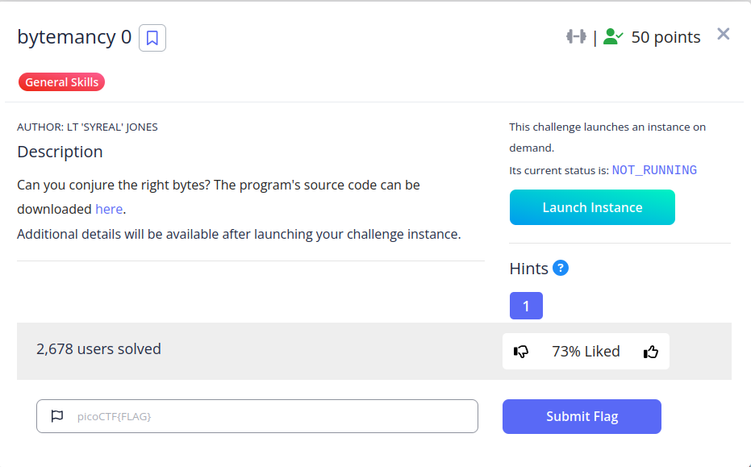

- **Event:** picoCTF 2026
- **Category:** General Skills
- **Challenge Author:** LT 'syreal' Jones
- **Write-up Author:** z3romove
- **Challenge URL:** https://play.picoctf.org/events/79/challenges/742


## Source Code Analysis
Looking at `app.py`, the core logic is found in the conditional check:

user_input = input('==> ')
if user_input == "\x65\x65\x65":
print(open("./flag.txt", "r").read())  

Key Observations:
- **The Clue:** The program prompts the user for: `ASCII DECIMAL 101, 101, 101, side-by-side, no space.`
- **The Comparison:** The code compares the input to `\x65\x65\x65`.
- **The Obfuscation:** The developer used hexadecimal escapes (`\x65`) to hide the required string from plain view.
## The Methodology

To solve this, we must translate the different representations of data:

1. **Decimal to ASCII:** Looking at an ASCII table, the decimal value **101** corresponds to the character **'e'**.
2. **Hex to ASCII:** In hexadecimal, `0x65` is equivalent to decimal **101**. Therefore, `\x65` in Python is interpreted as the character **'e'**.
3. **Final Payload:** Three `101` decimals or three `\x65` hex codes results in the string: `**eee**`.
## Exploitation

I executed the script and provided the calculated string at the prompt:
Plaintext

```
==> eee
```
## Lessons Learned

- **Data Representation:** This challenge reinforces that `101` (Decimal), `0x65` (Hex), and `'e'` (ASCII) are simply different ways of looking at the same byte of data.
- **Code Review:** Always check for escaped characters (`\x..` or `\u..`) when auditing source code, as they often hide sensitive logic or hardcoded credentials.
